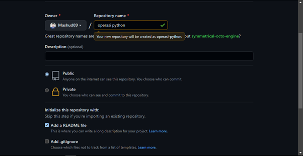
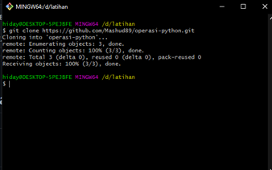
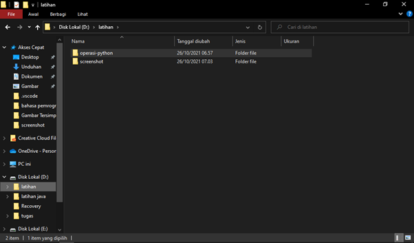
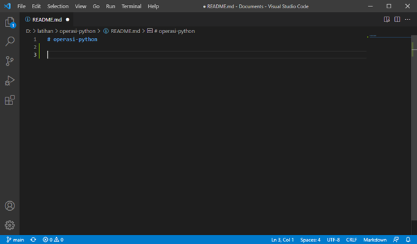
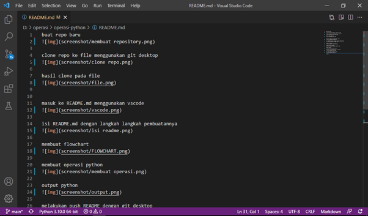
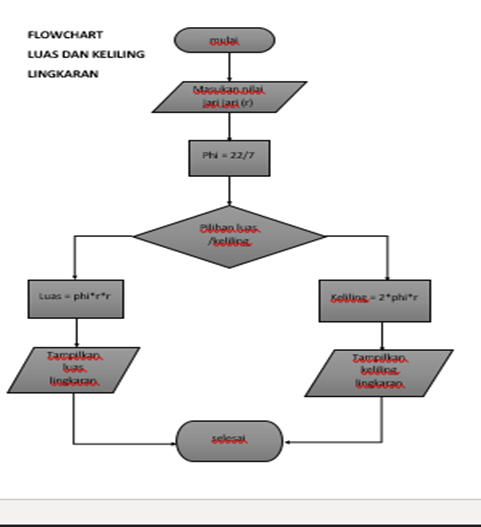
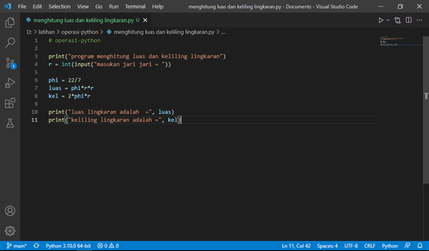
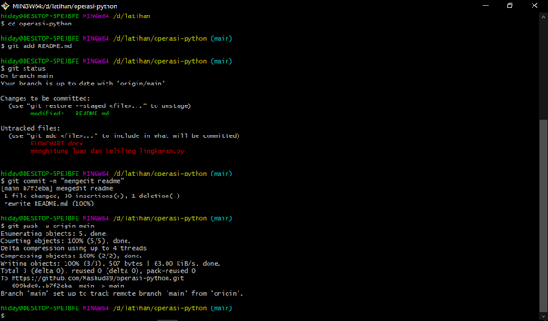
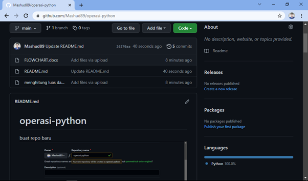

buat repo baru

clone repo ke file menggunakan git desktop

hasil clone pada file

masuk ke README.md menggunakan vscode

isi README.md dengan langkah langkah pembuatannya

membuat flowchart

membuat operasi python

output python

melakukan push README dengan git desktop

cek repo apakah sudah ter push

finish
