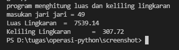
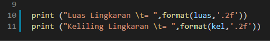

# tugas tipe data variasi dan operasi

## tugas

## flowchart 

untuk menentukan luas dan keliling lingkaran dapat
menggunakan langkah langkah sebagai berikut

# menghitung luas dan keliling lingkaran 

## code untuk menghitung

    print("program menghitung luas dan keliling lingkaran")
    r = int(input("masukan jari jari = "))

    phi = 3.14
    luas = phi*r*r
    kel = 2*phi*r

    print ("Luas Lingkaran \t= ",format(luas,'.2f'))
    print ("Keliling Lingkaran \t= ",format(kel,'.2f'))

ssss## rumus menghitung

berikut adalah rumus untuk menghitung luas dan keliling linngkaran

    nilai phi yang digunakan adalah 14 
    dan r adalah jari jari lingkaran

## output

ini adalah contoh output jika dimasukan jari jari dengan nilai 49

## penjelasan
untuk mengambil 2 angka pecahan saja kita pakai fungsi format *'.2f'* seperti berikut:

dengan rumus seperti diatas dapat mengambil kesimpulan 2 angka dibelakang titik